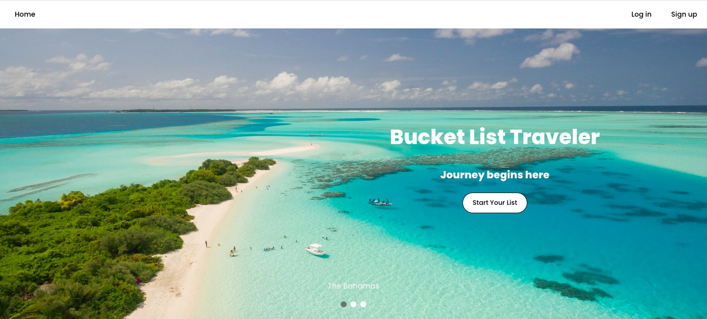
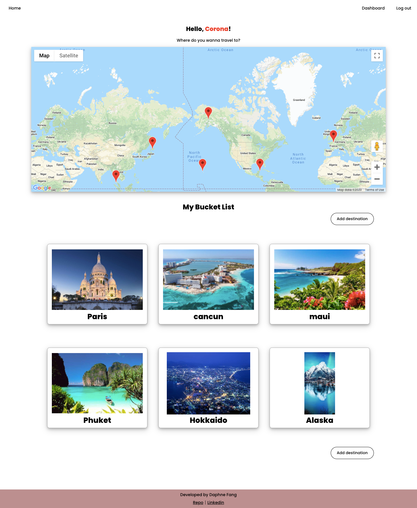
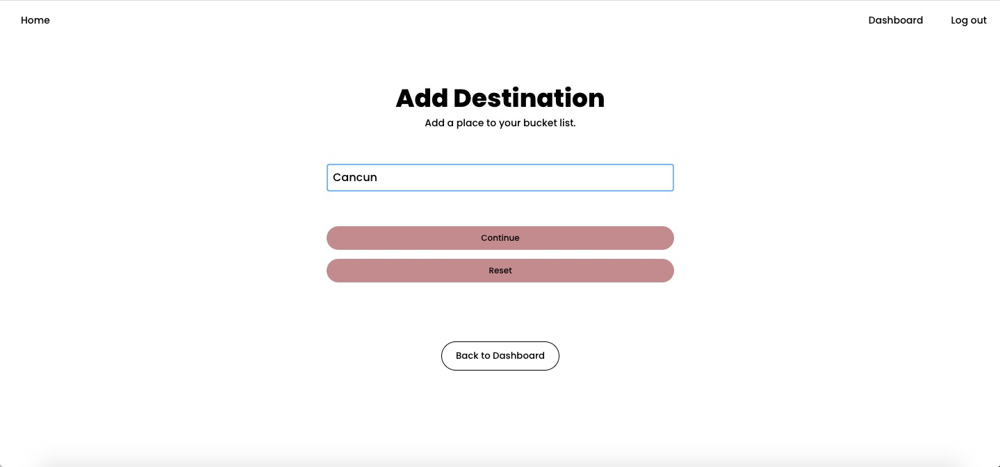
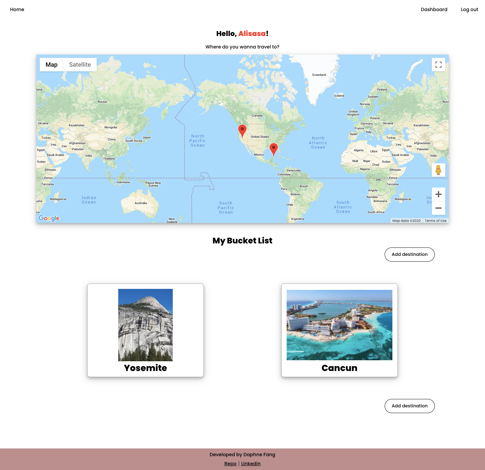
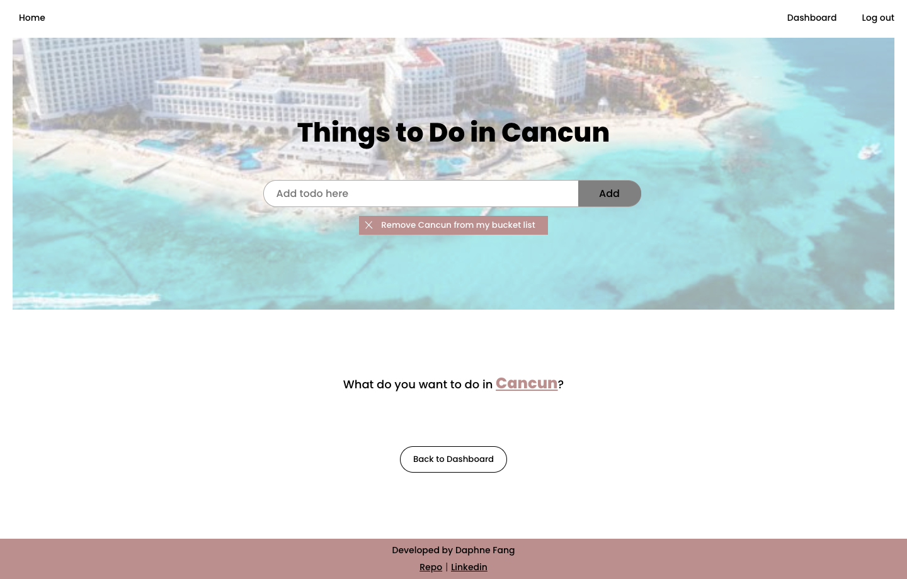

# Bucket List Traveler

Link to Live Demo: https://bucketlist-traveler-app.vercel.app/

## What is Bucket List Traveler?

Traveling seems not likely during the pandemic. By developing this app, desperate tarvelers (like me!) can at least have a list of destinations to dream on, plan on and quench the thirst for flying around. 

## Features

- *Add a destination:* Users can add destinations into the bucket list by entering the name of the location. This app works with Google Place API to fetch location photos. Marker pins of corresponding location dropped to the embedded map on dashboard after adding the location.

- *Add todos:* Users can add/edit/delete/check-off to-do items to the destinations respectively.

- *Authenticaion System:* Users can sign up for the service and create their own personal list. Log in the app to retrieve personal list. Log out feature is also available.

## Technology Used
- React
- JWT
- CSS
- JEST
- Google Place API
- Google Embedded Map API